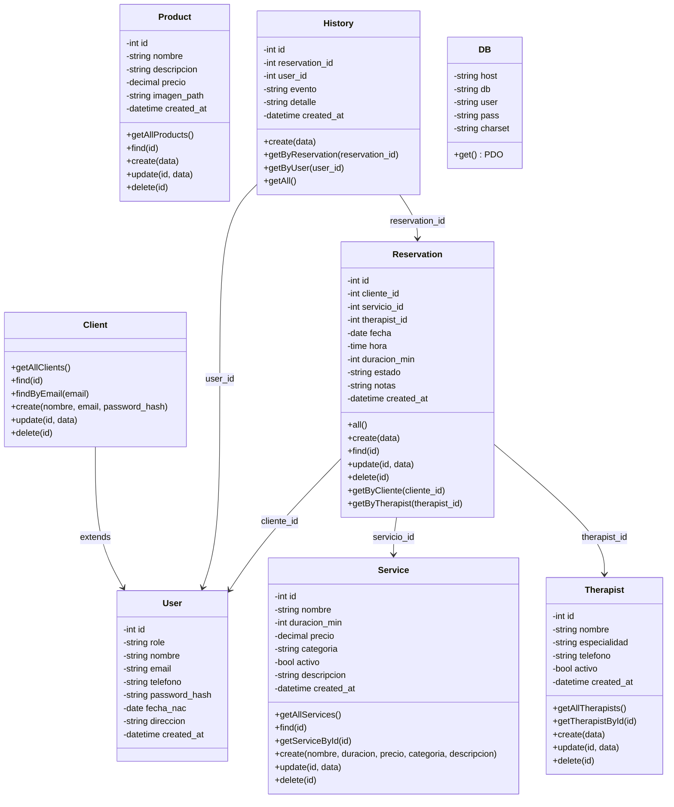
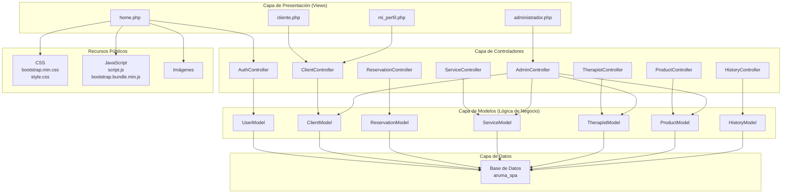
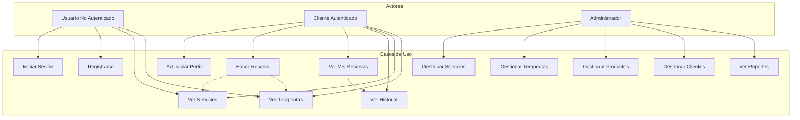
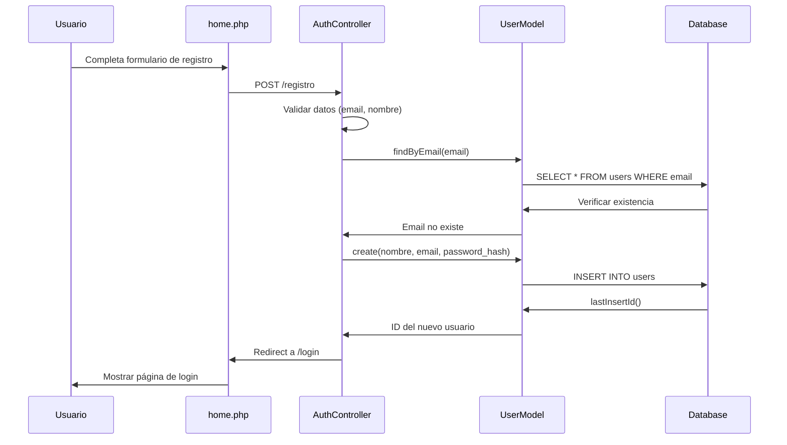
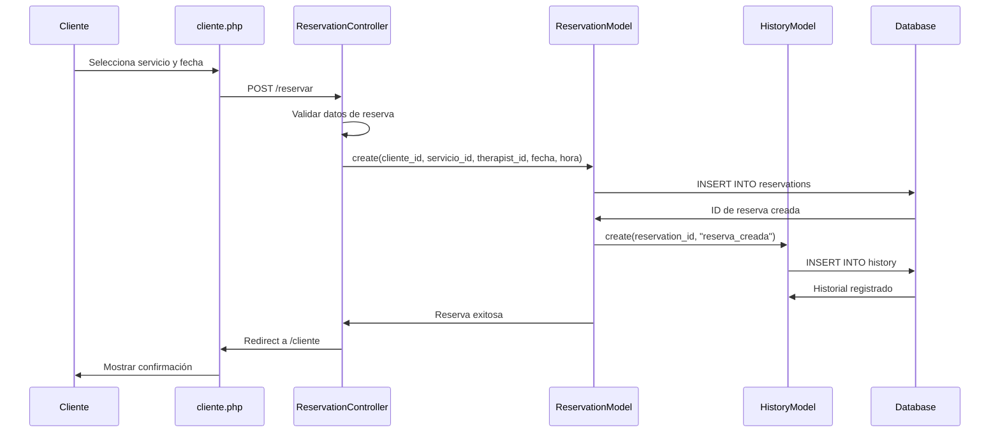
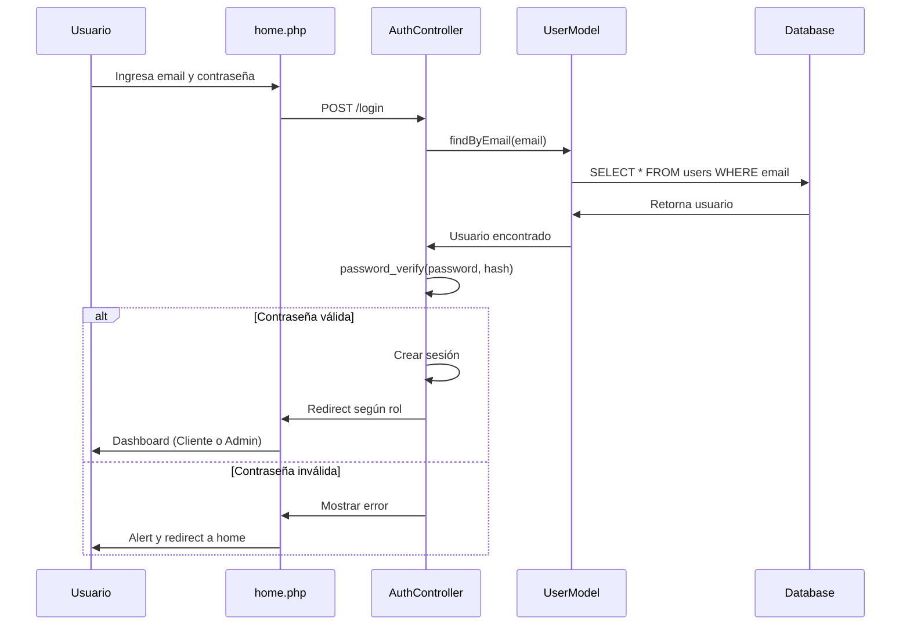
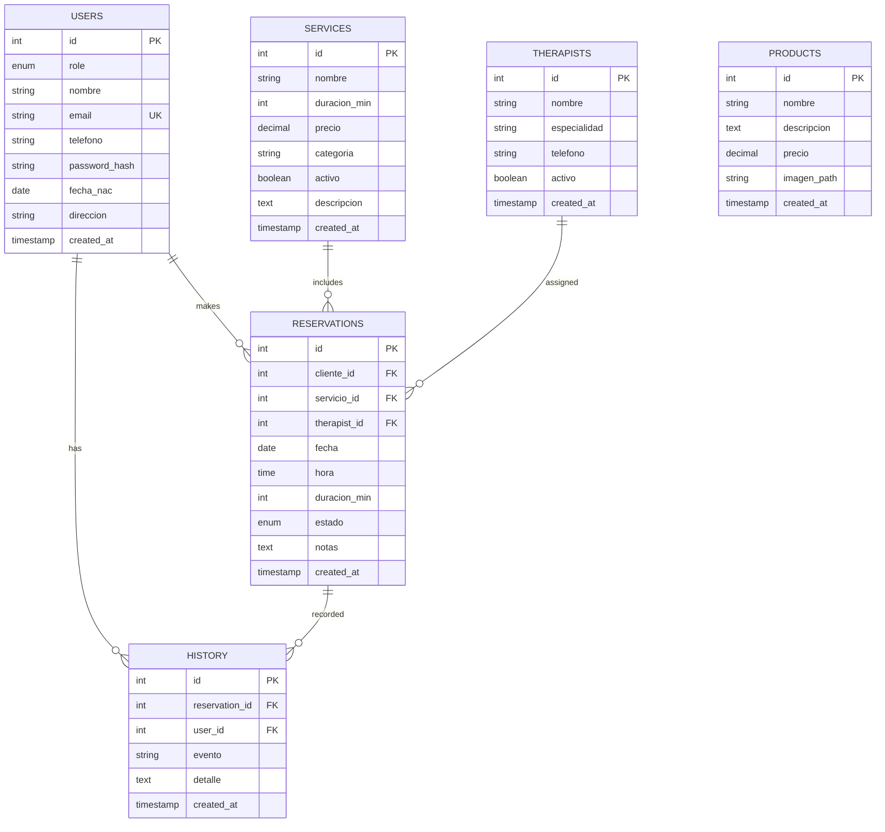
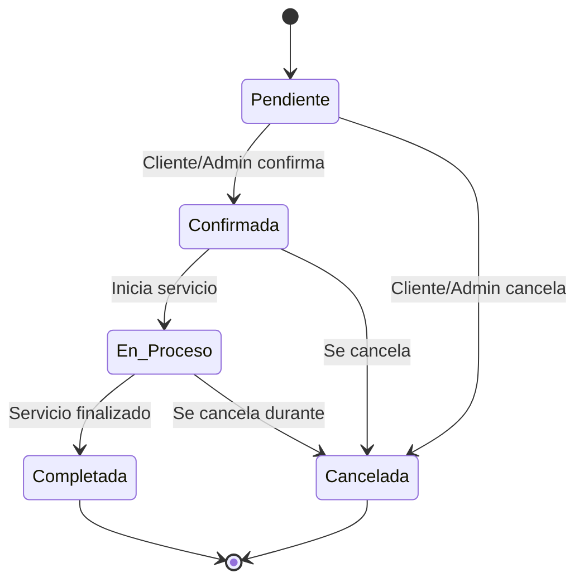
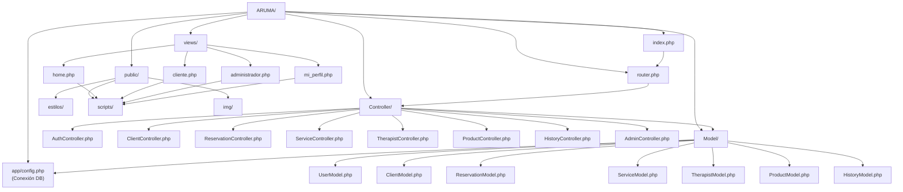

# Diagramas UML - Proyecto ARUMA Spa

## 1. Diagrama de Clases (Modelo de Datos)

## 2. Diagrama de Arquitectura MVC

## 3. Diagrama de Casos de Uso

## 4. Diagrama de Secuencia - Flujo de Registro

## 5. Diagrama de Secuencia - Flujo de Reserva

## 6. Diagrama de Secuencia - Flujo de Login

## 7. Diagrama de Base de Datos (ER)

## 8. Diagrama de Estados - Reserva

## 9. Matriz de Relaciones entre Componentes

| Componente | UserModel | ClientModel | ReservationModel | ServiceModel | TherapistModel |
|---|---|---|---|---|---|
| AuthController | ✓ | - | - | - | - |
| ClientController | ✓ | ✓ | ✓ | ✓ | - |
| ReservationController | - | - | ✓ | ✓ | ✓ |
| ServiceController | - | - | - | ✓ | - |
| TherapistController | - | - | - | - | ✓ |
| AdminController | ✓ | ✓ | ✓ | ✓ | ✓ |
| HistoryController | - | - | ✓ | - | - |

## 10. Estructura de Carpetas y Dependencias

---

## Explicación de la Arquitectura

### Patrones Utilizados:
- **MVC (Model-View-Controller)**: Separación clara entre lógica, datos y presentación
- **DAO (Data Access Object)**: Modelos actúan como DAO para acceso a datos
- **Singleton Pattern**: Clase DB proporciona única conexión

### Flujo de Solicitud Típico:
1. Usuario interactúa con **View** (HTML/PHP)
2. **Router** dirige a **Controller** apropiado
3. **Controller** procesa lógica y llama a **Models**
4. **Models** ejecutan consultas usando **DB**
5. Resultado retorna a **Controller**
6. **Controller** carga **View** con datos

### Tablas Principales:
- **users**: Almacena clientes y administradores
- **therapists**: Registro de terapeutas
- **services**: Servicios disponibles
- **reservations**: Citas/reservas con estados
- **history**: Auditoría de cambios
- **products**: Productos del spa

### Relaciones:
- Un **Cliente** puede hacer muchas **Reservas**
- Una **Reserva** requiere un **Servicio**
- Una **Reserva** puede asignarse a un **Terapeuta**
- Cada **Reserva** genera **Historial**
